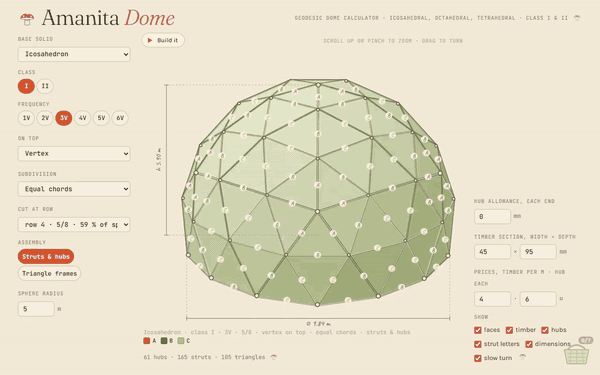
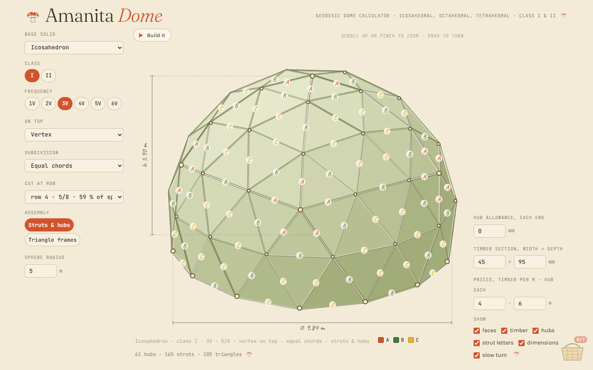
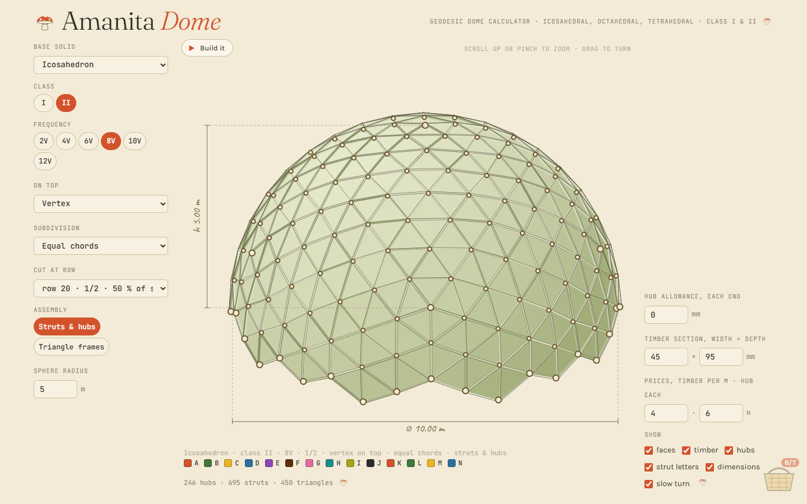
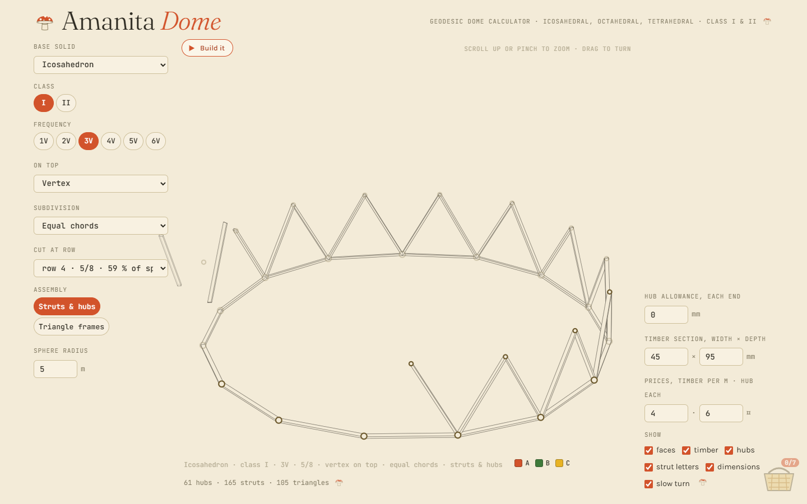
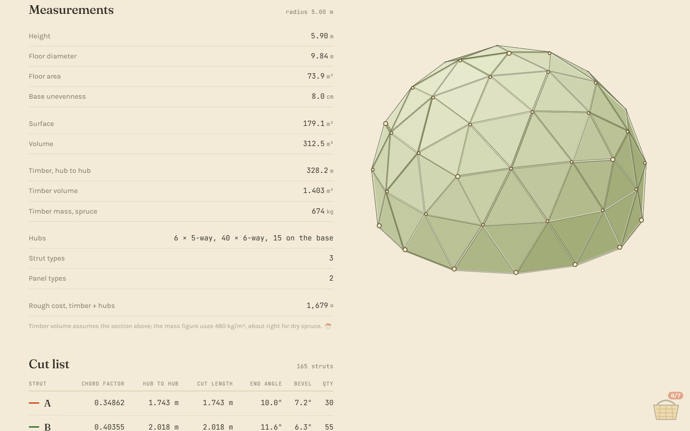
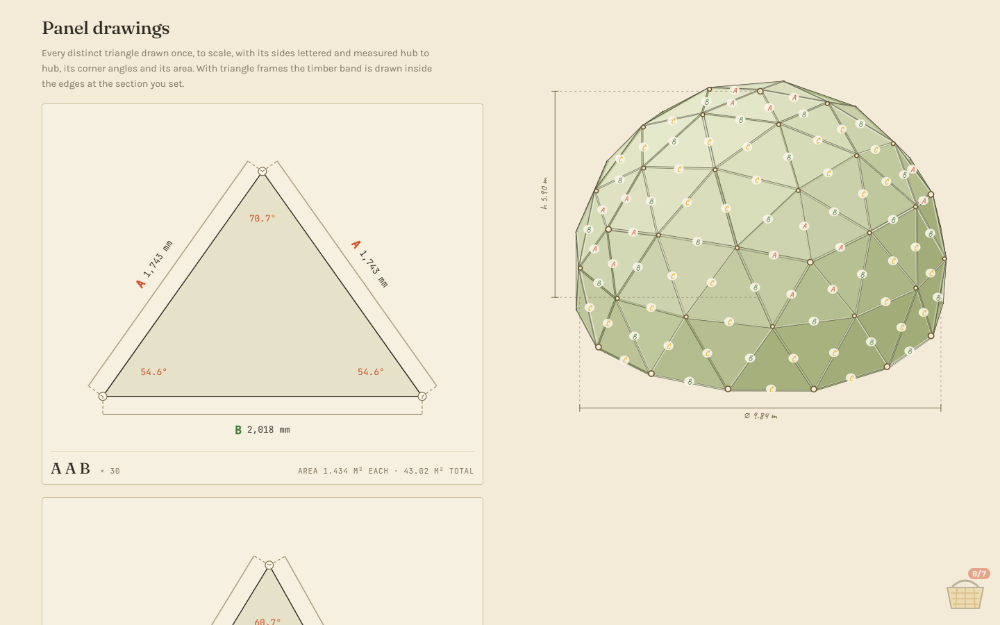
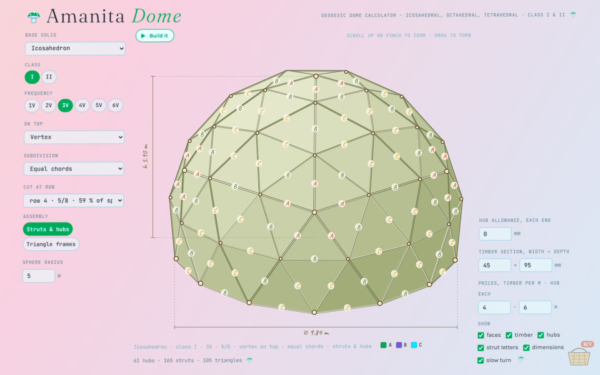

<div align="center">

# 🍄 Amanita *Dome*

### a geodesic dome configurator that fits in one HTML file and grows out of the forest floor

**[▶ open the live dome](https://goallthepath.github.io/AmanitaDome/)** · [watch the tour (mp4)](docs/amanita-dome-tour.mp4) · [the file itself](index.html)




</div>

---

> *You pick a solid. You break its faces into smaller and smaller triangles.*
> *You push every point outward until it touches the sphere.*
> *You cut the sphere at a row of knots, and what's left is a room.*
>
> *Somewhere in the page, something red with white spots is waiting.*
> *Put it in the basket and the page starts to breathe.*

---

## what is this

**Amanita Dome** calculates geodesic domes you can actually build out of wood. It's one `.html` file with no framework and no build step. You set the geometry, the timber and the prices, and it gives you:

- 🌀 **a rotatable 3D dome.** Every strut is drawn as a real timber box at your section size (45 × 95 mm by default), with angled ends at the hubs, strut letters, dimension lines and a slow turn. Drag, pinch, scroll or use the arrow keys.
- 🏗️ **an animated build.** Press **Build it** and the finished frame swirls away, the camera moves in, and the dome goes back up strut by strut, row by row from the base, in the same order as the written build guide. In triangle-frame mode every panel is framed on its own, spread out around the sphere, and then pulled together.
- 📏 **measurements.** Height, floor diameter, floor area, how far out of level the base is, surface, volume, timber length, volume and mass, hub count by valence, and a rough cost.
- 🪚 **a cut list.** Per strut type: chord factor, hub-to-hub length, cut length after the hub allowance, end angle, bevel and quantity. One click copies it as tab-separated text you can paste into a spreadsheet.
- 🔺 **panel drawings.** Every distinct triangle drawn to scale with its sides lettered and measured, its corner angles and its area.
- 📐 **strut drawings.** Workshop elevations with break lines, the angled end cuts, the outer and inner face lengths, and a cross-section.
- 📄 **a PDF workshop sheet.** A cover page with a render of the dome and the configuration, then measurements, cut list, panels, build sequence, and panel and strut drawings. It's all generated in the browser; nothing is uploaded.
- 🧺 **a basket.** Leave it alone. Or don't.

## the knobs

| knob | options | what it does |
|---|---|---|
| **Base solid** | icosahedron · octahedron · tetrahedron | the polyhedron the dome is grown from |
| **Class** | I · II | class I grid runs parallel to the solid's edges; class II is rotated 30° |
| **Frequency** | 1V – 6V (class II: 2V – 12V) | how many parts each original edge is split into |
| **On top** | vertex · edge · face | what points straight up at the zenith |
| **Subdivision** | equal chords · equal arcs | how the grid points are placed on the sphere |
| **Cut at row** | every row of hubs | ½ dome, ⅝ dome, ¾ …, all the way to a full sphere |
| **Assembly** | struts & hubs · triangle frames | build from single struts on hubs, or from pre-framed triangles bolted together |
| **Sphere radius** | metres | scales everything |
| **Hub allowance** | mm per end | subtracted from every strut to give the cut length |
| **Timber section** | width × depth mm | used in the 3D view, the drawings, timber volume and mass |
| **Prices** | per metre · per hub | for the rough cost |

<table>
<tr>
<td><br><sub>icosahedron · class I · 3V · 5/8 · 61 hubs · 165 struts</sub></td>
<td><br><sub>class II · 8V · ½ · 246 hubs · 695 struts · 14 strut types</sub></td>
</tr>
<tr>
<td><br><sub>“Build it”, row 1 going up</sub></td>
<td><br><sub>measurements and cut list; the dome follows you down the page</sub></td>
</tr>
<tr>
<td colspan="2"><br><sub>panel drawings: every distinct triangle to scale</sub></td>
</tr>
</table>

---

## the math

Everything is computed on a **unit sphere** and only multiplied by the radius at the end: lengths by *R*, areas by *R²*, volumes by *R³*. The vertical axis is *z*.

### 1 · the seed solids

The icosahedron is written out directly: one vertex at the north pole, a ring of five at height $z = 1/\sqrt5$ and radius $2/\sqrt5$, a second ring of five rotated by $36°$ at $z = -1/\sqrt5$, and one vertex at the south pole. That gives 20 faces. The octahedron sits on the axes and the tetrahedron on alternate corners of a cube.

### 2 · pointing it the right way up

To put a vertex, an edge midpoint or a face centre $\mathbf u$ at the zenith, the whole solid is rotated with **Rodrigues' formula** about the axis $\mathbf k = \frac{\mathbf u \times \hat z}{\lVert\mathbf u\times\hat z\rVert}$:

$$\mathbf v' = \mathbf v\cos\theta + (\mathbf k\times\mathbf v)\sin\theta + \mathbf k\,(\mathbf k\cdot\mathbf v)(1-\cos\theta)$$

### 3 · breaking the faces: class I

Each face $ABC$ gets a triangular grid of frequency $f$. Grid point $(i,j)$:

- **equal chords.** Take the flat barycentric point and push it out onto the sphere:
  $$P_{ij} = \operatorname{norm}\!\left(\frac{(f-i-j)\,A + i\,B + j\,C}{f}\right)$$
- **equal arcs.** Walk along the sphere's surface instead of through it, using **slerp**,
  $$\operatorname{slerp}(a,b,t) = \frac{\sin((1-t)\omega)}{\sin\omega}\,a + \frac{\sin(t\omega)}{\sin\omega}\,b,\qquad \omega = \arccos(a\cdot b)$$
  first along two edges from one corner, then across. Doing this from all three corners and averaging keeps any corner from being favoured, and it evens out the strut lengths a little.

Points shared by neighbouring faces are merged with a hash of their coordinates rounded to $10^{-5}$.

### 4 · class II

Before subdividing, every face gets a new vertex at its centre (projected to the sphere), and every original edge becomes two triangles: one edge end plus the two neighbouring face centres. The grid turns by 30° and the real frequency doubles, $\nu = 2f$, which is why class II only comes in even frequencies.

### 5 · cutting the sphere into a dome

All hub heights are collected and sorted, and heights within $0.22/\nu$ of each other count as one **row**. With a vertex on top and an odd frequency, the row the classic **3V ⅝ dome** sits on isn't quite level. The app reports that spread as *base unevenness* (about 8 cm at R = 5 m), which tells you how much packing to have ready. Only triangles with all three corners above the cut are kept. The dome fraction is the height $h = (1-z_c)/2$ rounded to eighths and reduced with Euclid's gcd.

### 6 · struts

- **chord factor** $c$ = strut length on the unit sphere. Hub to hub $= c\cdot R$. Struts whose lengths differ by less than $2\cdot10^{-5}$ are one **type**, named A, B, C, … (the 3V classics come out as $0.34862$, $0.40355$, $0.41241$).
- **end angle.** A chord $c$ subtends the central angle $\alpha$ with $c = 2\sin(\alpha/2)$. The strut meets the hub's tangent plane at
  $$\beta = \arcsin(c/2)$$
  and that's the angle you cut from square. The outer face comes out longer than the inner face by $d\tan\beta$ (where $d$ is the timber depth).
- **bevel.** For each edge, take the outward normals $n_1, n_2$ of the two panels that meet there:
  $$\text{bevel} = \tfrac12\arccos(n_1\cdot n_2)$$
  That's half the fold angle, planed off the long edges so the panels sit flat. The table shows the mean for each type.
- **hub valence.** How many struts meet at each hub (5 around the original solid's vertices, 6 elsewhere), plus the base hubs.

### 7 · area and volume

- **surface.** $\sum \tfrac12\lVert (B-A)\times(C-A)\rVert$
- **floor.** The base ring sorted by angle around the vertical axis, then the **shoelace formula** $\tfrac12\left|\sum x_k y_{k+1} - x_{k+1}y_k\right|$
- **volume.** Sum of the tetrahedra from the sphere's centre to every panel, minus the cone above or below the floor:
  $$V = \sum \frac{|A\cdot(B\times C)|}{6} \;-\; \frac{z_c\,A_\text{floor}}{3}$$
- **height** $(1-z_c)R$, **floor diameter** $2\sqrt{1-z_c^2}\,R$
- **timber mass** = Σ cut lengths × width × depth × 480 kg/m³ (dry spruce)

### 8 · panels in the plane

Each triangle type is laid flat with its longest side $c$ at the bottom. The apex is found with the **law of cosines**, $x = \frac{b^2+c^2-a^2}{2c}$, $h=\sqrt{b^2-x^2}$, and the corner angles the same way. In triangle-frame mode each side is offset inwards by the timber width and the offset lines are intersected to draw the mitred frame.

---

## the approaches: how one file does all of this

- **One IIFE, zero globals.** Everything lives inside a single `(function(){ 'use strict'; … })()`.
- **No 3D engine.** The dome is drawn on a plain 2D `<canvas>`. Each strut is a real **8-corner timber box**: its depth lies along the hub's radial and its width along $\text{axis}\times\text{radial}$, and it's shortened by the hub allowance. Faces are depth-sorted and painted back to front (the **painter's algorithm**), and shading is a mix of `--face-lit` and `--face-dark` from the face normal. Colours are read from the CSS custom properties, so the page and the render always match.
- **One timeline.** The build animation, the status line and the highlighted step in the written guide all come from the same `buildOrder()`: rows from the base up, horizontal struts before rising ones, and around each ring by angle.
- **The dome follows you.** The canvas is fixed behind the whole page. Empty "dock" cells sit alternately left and right of the lists, and each frame the dome eases into whichever dock is most visible, so it slides alongside you as you scroll down.
- **Zoom is elastic.** Wheel, pinch or `+`/`−` zoom in, and once you stop it drifts back to 1 on its own. Below the top of the page the canvas lets the pointer through, so scrolling goes to the page instead of the dome.
- **SVG drawings are built as strings.** The strut and panel drawings are template literals producing SVG, so they stay sharp at any zoom and print cleanly.
- **The PDF is made in the browser.** [jsPDF](https://github.com/parallax/jsPDF) (the only dependency, loaded from cdnjs) draws the same drawings again with lines measured in millimetres, not pixels. The cover render is copied straight from the live canvas.
- **It respects `prefers-reduced-motion`.** No spin, no animation, no trip.
- **The comments are in Early New High German.** The source is organised into five *Capitel* (I. vectors in space, II. the base solids and their subdivision, III. the cut, IV. output, V. drawing and controls), and every comment is written like a 17th-century arithmetic book:

  > *„Wisse, geneigter Leser: Eine geodætische Kuppel ist nichts anderes denn ein Vielflach …"*

  Open `index.html` and read it. It's half the fun.

---

## 🍄 about the basket

<div align="center">

<br><sub><i>the page, a few seconds after something went into the basket</i></sub>
</div>

<br>

There's a basket in the bottom-right corner, and it says `0/7`.

That's all this README is going to tell you.

<details>
<summary>ok, a small hint</summary>

<br>

Read the page slowly. Look along the edges of the text, the corners of the lists and the end of the lines. Things with red caps can be picked up.

</details>

<details>
<summary>and what happens at seven?</summary>

<br>

The page stops coming down. For a while.

</details>

---

## run it

**Online:** https://goallthepath.github.io/AmanitaDome/ (served by GitHub Pages straight from `main`).

**Offline:** download [`index.html`](index.html) and open it in a browser. That's it. The fonts and jsPDF come from a CDN; without internet the page falls back to system fonts and only the PDF export stops working.

## repo

```
index.html                   the whole app: geometry, rendering, drawings, PDF, mushrooms
docs/amanita-dome-tour.mp4   84 s screen recording
docs/amanita-dome-tour.gif   the same, sped up, for this README
docs/*.png                   screenshots
```

## disclaimer

The numbers are geometry, not engineering. Check loads, snow, wind, fixings and local building rules before you trust a dome with people inside. Cut one test strut of every type before you cut a hundred and sixty-five.

---

<div align="center">

made by one person · MIT licensed · grown on the forest floor 🍄

</div>
